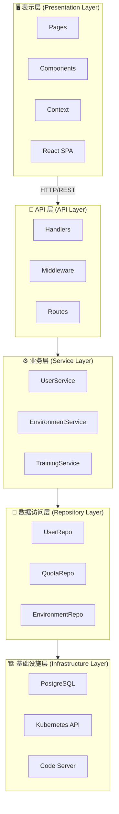
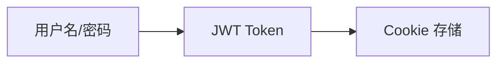
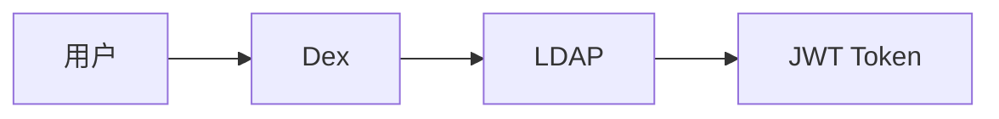
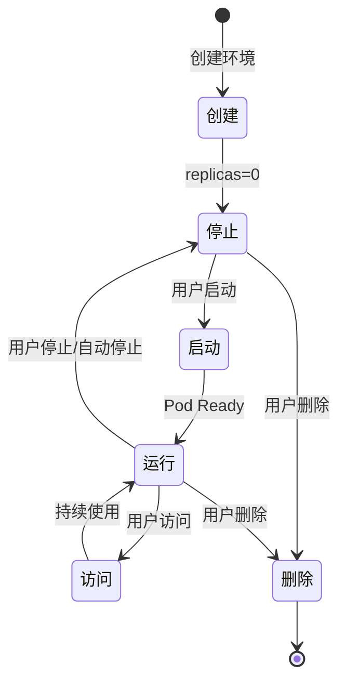
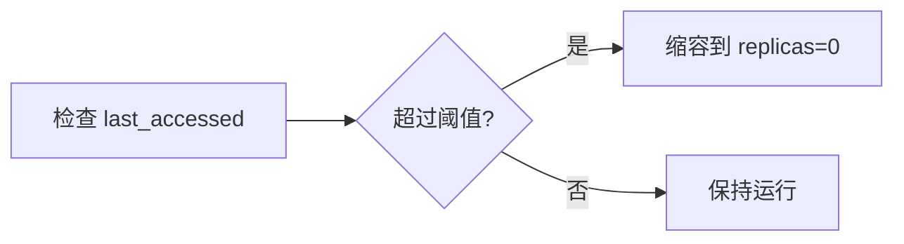

# 系统架构

本文档介绍 LuoSS K8s 租户管理平台的系统架构设计。

## 架构概览

<ArchitectureDiagram type="overview" title="LuoSS 平台架构" />

## 核心组件

### 前端层

| 组件 | 技术栈 | 说明 |
|------|--------|------|
| UI 框架 | React 18 | 现代化组件框架 |
| UI 库 | Ant Design 5 | 企业级 UI 组件库 |
| 构建工具 | Vite | 快速构建工具 |
| 图表 | ECharts | 数据可视化 |
| 路由 | React Router v6 | 客户端路由 |

### 后端层

| 组件 | 技术栈 | 说明 |
|------|--------|------|
| 框架 | Go 1.24 + go-restful | RESTful API 框架 |
| ORM | GORM | 数据库 ORM |
| K8s 客户端 | client-go | Kubernetes 官方客户端 |

### 数据层

| 组件 | 说明 |
|------|------|
| PostgreSQL | 主数据库，存储用户、配额、环境等元数据 |
| Kubernetes | 容器编排，管理用户环境和训练任务 |
| PVC | 持久化存储，用户数据持久化 |

## 架构层次



## 多租户架构

<ArchitectureDiagram type="user-namespace" title="用户命名空间架构" />

### 租户隔离机制

#### 1. 命名空间隔离

每个用户分配独立的 Kubernetes 命名空间：

```
user-{username}
```

例如：`user-alice`、`user-bob`

#### 2. 资源配额隔离

每个命名空间配置 ResourceQuota：

```yaml
apiVersion: v1
kind: ResourceQuota
metadata:
  name: user-quota
  namespace: user-alice
spec:
  hard:
    requests.cpu: "4"
    requests.memory: 8Gi
    limits.cpu: "8"
    limits.memory: 16Gi
    requests.npu: "2"
    persistentvolumeclaims: "5"
    pods: "10"
```

#### 3. 网络隔离

通过 NetworkPolicy 实现网络隔离：

```yaml
apiVersion: networking.k8s.io/v1
kind: NetworkPolicy
metadata:
  name: default-deny
  namespace: user-alice
spec:
  podSelector: {}
  policyTypes:
    - Ingress
    - Egress
```

#### 4. RBAC 隔离

用户只能访问自己命名空间的资源：

```yaml
apiVersion: rbac.authorization.k8s.io/v1
kind: Role
metadata:
  name: user-role
  namespace: user-alice
rules:
  - apiGroups: [""]
    resources: ["pods", "services", "pvc"]
    verbs: ["get", "list", "create", "delete"]
```

## 认证流程

<ArchitectureDiagram type="auth-flow" title="认证流程" />

### 认证方式

#### 1. 本地认证



#### 2. OIDC 认证（可选）



### Token 验证

每次请求携带 JWT Token：

```bash
Authorization: Bearer <token>
```

中间件验证 Token 并提取用户信息。

## 数据流

<ArchitectureDiagram type="data-flow" title="数据流架构" />

### 存储挂载

| 环境 | 挂载路径 | 说明 |
|------|----------|------|
| Code Server | `/config/workspace` | 用户工作目录 |
| 训练任务 | `/models` | 模型和数据目录 |

### 存储生命周期

1. **创建用户** → 自动创建 PVC
2. **创建环境** → 挂载 PVC 到 Pod
3. **删除环境** → PVC 保留
4. **删除用户** → 可选删除 PVC

## Code Server 集成

### 架构设计

每个开发环境对应 K8s 资源：

| 资源 | 名称格式 | 说明 |
|------|----------|------|
| Deployment | `codeserver-{env-id}` | 运行 Code Server Pod |
| Service | `codeserver-{env-id}` | 暴露服务端口 |
| PVC | `pvc-{username}` | 持久化存储 |

### 生命周期



### 自动停止

通过 CronJob 定期检查空闲环境：



## 优先级调度（可选）

当启用优先级调度时：

| 优先级 | 说明 | 资源访问 |
|--------|------|----------|
| 高优先级 | 关键用户 | 更多 NPU 资源，可抢占 |
| 低优先级 | 普通用户 | 有限资源，可被抢占 |

详见 [优先级调度](/admin/priority-scheduling)。

## 可扩展性设计

### 水平扩展

- **无状态 API**：可部署多个副本
- **PostgreSQL**：支持主从复制
- **Redis**：可选，用于会话缓存

### 高可用配置

```yaml
# 多副本部署
replicaCount: 3

# Pod 反亲和性
affinity:
  podAntiAffinity:
    preferredDuringSchedulingIgnoredDuringExecution:
      - weight: 100
        podAffinityTerm:
          labelSelector:
            matchLabels:
              app: k8s-tenant-platform
          topologyKey: kubernetes.io/hostname
```

## 监控与可观测性

### 指标收集

- **Prometheus**：指标收集
- **Grafana**：可视化仪表盘

### 关键指标

| 指标 | 说明 |
|------|------|
| API 延迟 | 请求响应时间 |
| 错误率 | API 错误比例 |
| 资源使用 | CPU、内存、NPU 使用率 |
| 环境数量 | 活跃环境数量 |

## 安全架构

详见 [安全指南](/guide/security)。

## 下一步

- [安全指南](/guide/security)
- [用户管理](/admin/users)
