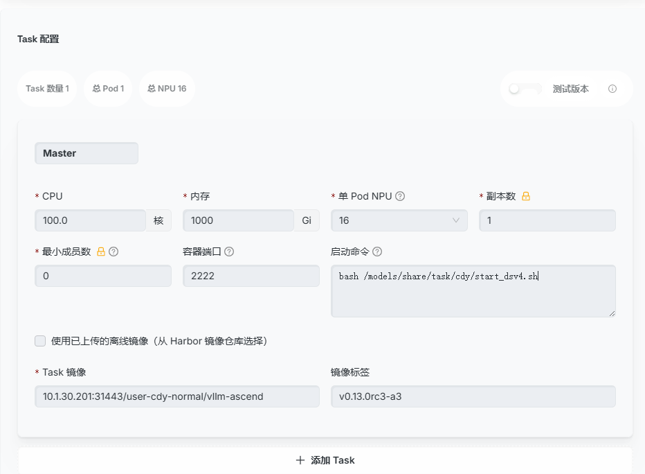

# 基于 VLLM-Ascend 启动 deepseek-v4-flash 分布式推理实例

## 概述

本节介绍如何使用 VLLM-Ascend 启动 deepseek-v4-flash 分布式推理实例。

## 前端提交

选择前端提交方式，参考下图操作：



## 启动命令

```bash
bash /models/share/task/cdy/start_dsv4.sh   # master 任务启动命令
10.1.30.201:31443/user-cdy-normal/vllm-ascend:v0.13.0rc3-a3    # 镜像路径
```

## 终端提交

```bash
# 查看自己账号可以使用的队列然后对应调整
ktp queues

# 只需要修改 queue 对应参数即可
vi /models/share/task/cdy/deepseek-v4-flash.yaml

# 提交任务
ktp submit -f /models/share/task/cdy/deepseek-v4-flash.yaml

# 提交后可以观察任务情况
ktp list

# 查看任务启动后的日志，后方的 899 根据个人具体任务的编号调整，follow参数是实时跟踪，不加的话就是读取最新的100行
ktp logs 899 --follow
```

::: info 配置说明
在开发环境中使用命令 `vi /models/share/Qwen3.5-122B-A10B/start_master.sh` 即可编辑里面的内容。
:::

## 测试推理服务

### 发送请求测试

进入 master 节点的终端运行以下命令：

```bash
curl http://localhost:8005/v1/chat/completions \
  -H "Content-Type: application/json" \
  -d '{
    "model": "deepseek-v4",
    "messages": [
      {"role": "user", "content": "9.11 和 9.8 哪个数字更大？请一步步推理。"}
    ],
    "chat_template_kwargs": {"thinking": true}
  }'
```

### 吞吐测试

进入 master 节点终端运行以下命令进行吞吐测试：

```bash
vllm bench serve \
--backend vllm \
--base-url http://localhost:8005 \
--model qwen3.5 \
--tokenizer /models/share/DeepSeek-V4-Flash-w8a8-mtp \
--dataset-name random \
--num-prompts 10 \
--request-rate inf \
--input-len 128 \
--output-len 256
```

::: warning 注意
如果是模型第一次推理会很慢，因为需要激活参数，所以测试的时候第一次的结果仅作为参考，后续进行的测试会是正常的性能情况。
:::
