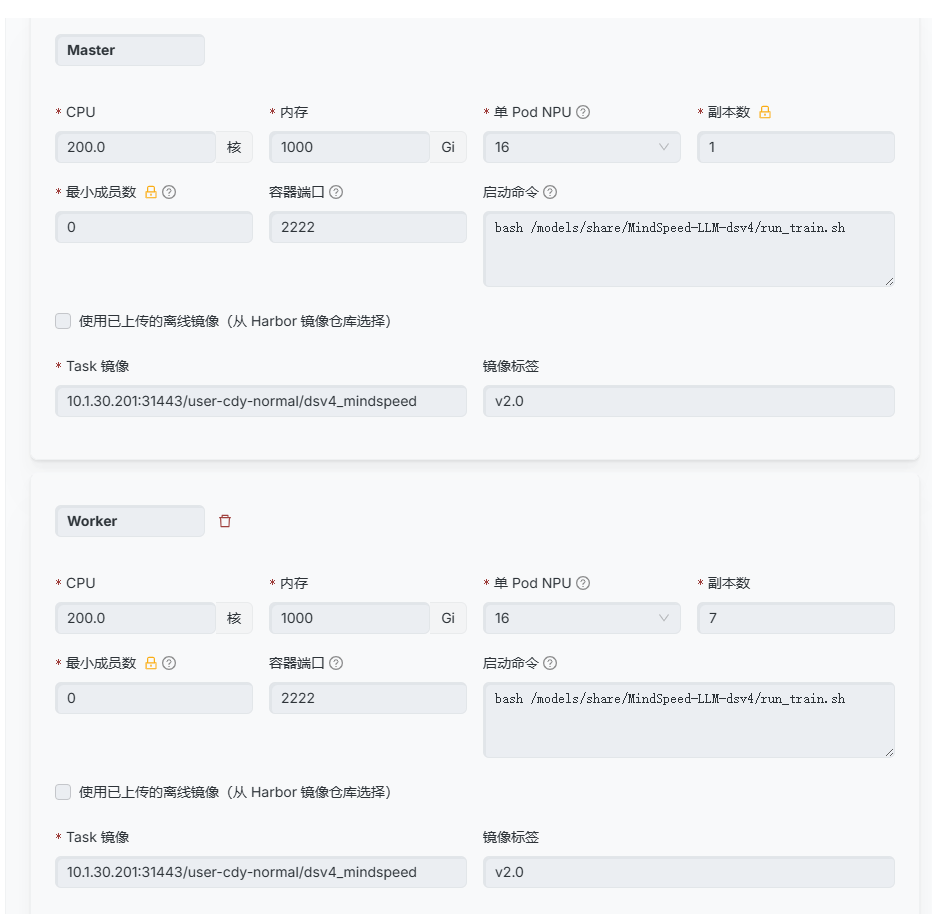

# 基于 MindsSpeed LLM 启动 deepseek-v4-flash 分布式训练实例

## 概述

本节介绍如何使用 MindsSpeed LLM 启动 deepseek-v4-flash 分布式训练实例。

## 前端提交

选择前端提交方式，参考下图操作：



## 启动命令

```bash
bash /models/share/MindSpeed-LLM-dsv4/run_train.sh                      # 启动命令
10.1.30.201:31443/user-cdy-normal/dsv4_mindspeed:v2.0                   # 镜像路径
```

## 终端提交

```bash
# 查看自己账号可以使用的队列然后对应调整
ktp queues

# 只需要修改 queue 对应参数即可
vi /models/share/task/cdy/deepseek-v4-flash-train.yaml

# 提交任务
ktp submit -f /models/share/task/cdy/deepseek-v4-flash-train.yaml

# 提交后可以观察任务情况
ktp list

# 查看任务启动后的日志，后方的 899 根据个人具体任务的编号调整，follow参数是实时跟踪，不加的话就是读取最新的100行
ktp logs 899 --follow
```

## 相关资源

训练所需的权重和代码已放置在 `/models/share/MindSpeed-LLM-dsv4/` 目录下。
