# 快速开始

本手册用于指导用户在调度平台上进行 **Ascend（昇腾）环境下的多节点****分布式****训练与推理任务**，涵盖：

- 调度平台介绍

- 基础环境配置

- 基于torchrun启动yolo分布式训练实例

- 基于mindspeedLLM启动Qwen-2.5-7b分布式训练实例

- 基于VLLM-Ascned启动Qwen-3.5-1222B-A10B分布式推理实例

- 常见问题排查

# 调度平台介绍

## 仪表盘

查看超节点集群内各项资源使用情况以及属于自己的配额情况

## 开发环境

创建开发环境用于代码更改，开发环境启动后点击详情界面进入可以查看对应的密码

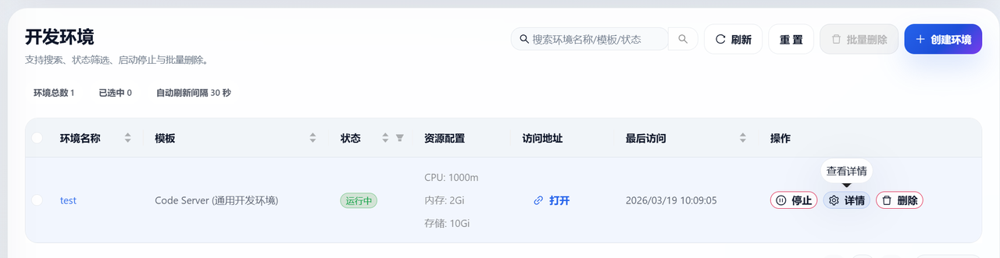

## 训练任务

用于启动单节点或者多节点训练与推理任务，在创造任务界面可以选择单Task和自定义两种模式，需要注意的是单Task启动的任务实际启用的是vcjob而使用自定义任务则是启动的acjob，两者的环境变量会有一些区别，这部分会在后面的环境配置部分详细介绍。

参数名称前面带红色*号的为必填项，具体信息可以将光标悬停在？上进行查看

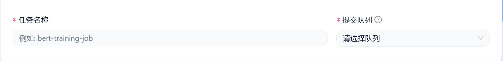

如果希望进行多节点分布式的训练与推理，建议使用自定义任务模式，按需更改设置，例如我希望启动一个80卡的任务，使用如下配置

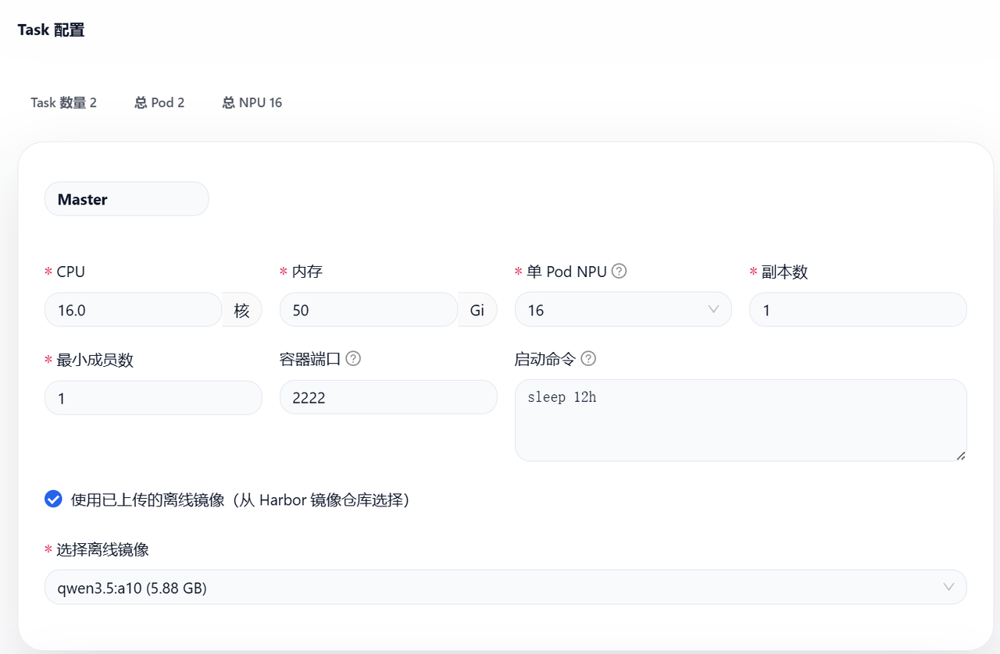

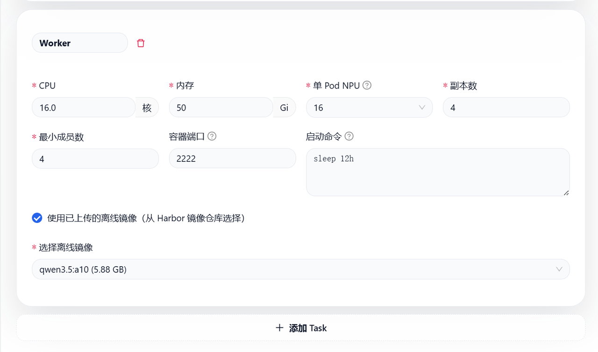

对于固定的Master节点，副本数和最小成员数都被固定为1，使用添加Task按钮增加Worker节点，设置4副本数，从而总共使用npu数量为1*16+4*16=80。对于参数设置，上方仅作为参考，实际使用中按照需要更改。对于离线镜像部分，会在后续镜像存储部分介绍，如果希望使用在线镜像，选择国内能够访问的镜像地址即可，如果需要使用其它用户的镜像，需要其它用户提供对应的镜像地址和镜像名，这部分具体实践在后续的实例章节会介绍。

训练任务启动后可以进入详情界面查看任务的日志输出是否正常，也可以进入终端界面进行简单调试，在进入终端按钮前面的选项中可以选择进入哪个pod的终端，终端界面中不要使用vi命令，会导致终端卡死。

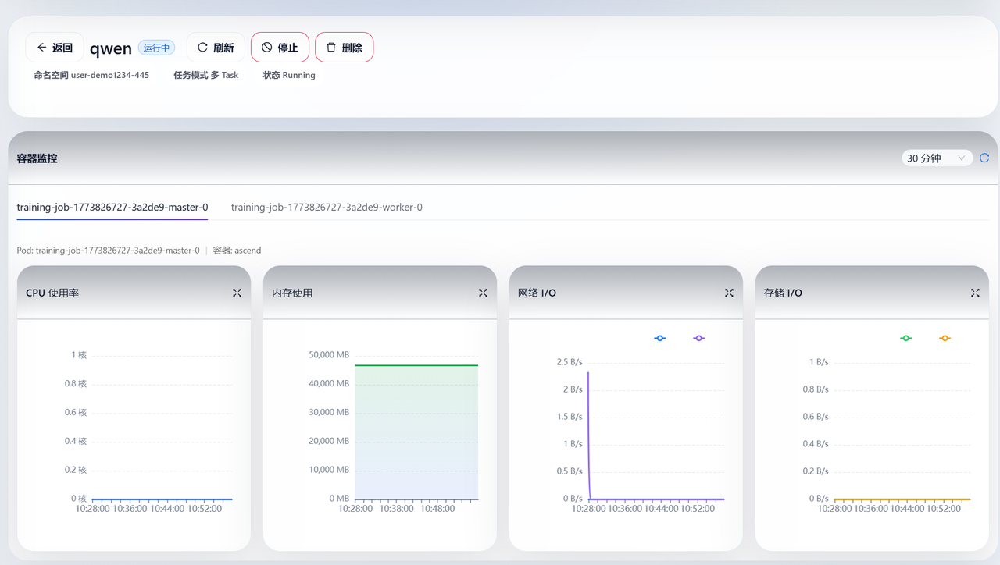

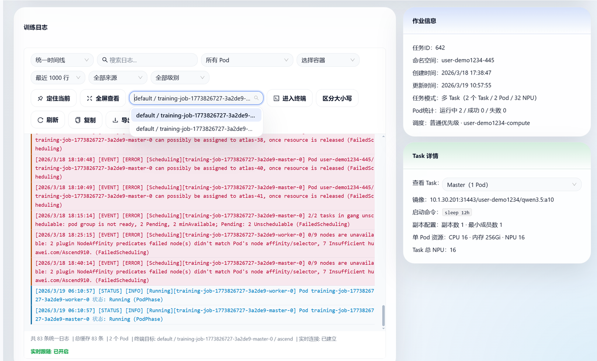

## 数据存储

数据存储界面可以进行训练代码以及权重的上传，目前仅支持压缩包的形式进行上传，上传后会位于/models目录当中，可以通过训练任务中的终端验证路径是否正常

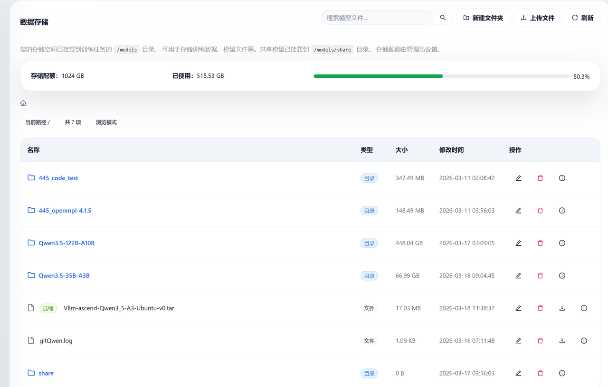

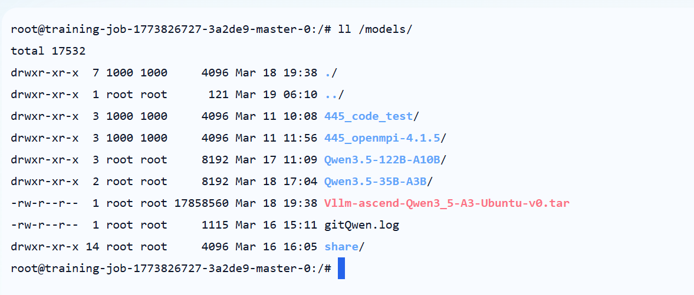

## 镜像存储

可以上传本地的镜像文件，上传后会自动完成导入，后续可以在启动训练任务部分勾选使用离线镜像后使用，如果电脑本地安装了docker-desktop或者其它可以使用docker的环境，可以使用凭证在本地将镜像上传到网站端，以及可以使用其它用户上传的镜像

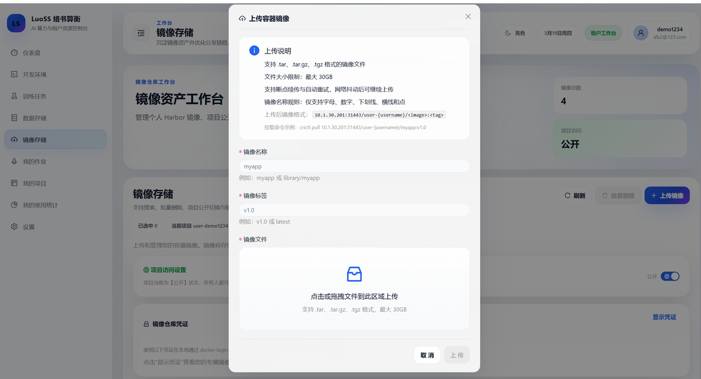

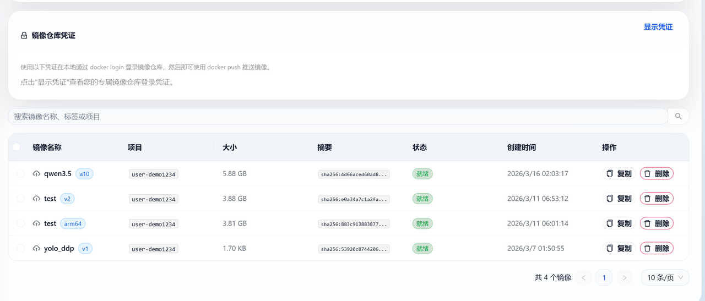

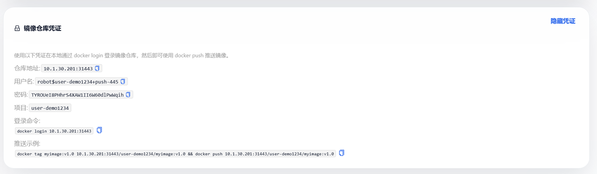

首先点击复制希望分享的镜像比如yolo_ddp，随后在地址前方加上仓库凭证中的仓库地址，具体的应用在后续的实例中

```Plain
docker pull user-demo1234/yolo_ddp:v1       #yolo_ddp复制
10.1.30.201:31443/user-demo1234/yolo_ddp:v1 #最终分享的镜像地址
```

# 基础环境配置

对于环境配置部分，建议使用Ascend官方或者社区提供的镜像，会在启动当中自动完成大部分环境配置。

首先使用`npu-smi info`命令确认所有显卡状态是否正常连接，如果没有正常显示使用以下命令尝试修复

```Plain
source /usr/local/Ascend/ascend-toolkit/set_env.sh#如果遇到报错提示没有source命令，使用下面命令进行环境变量设置
export    LD_LIBRARY_PATH=/usr/local/Ascend/driver/lib64:/usr/local/Ascend/driver/lib64/common:/usr/local/Ascend/driver/lib64/driver:$LD_LIBRARY_PATH
export ASCEND_TOOLKIT_HOME=/usr/local/Ascend/ascend-toolkit/latest
export LD_LIBRARY_PATH=${ASCEND_TOOLKIT_HOME}/lib64:${ASCEND_TOOLKIT_HOME}/lib64/plugin/opskernel:${ASCEND_TOOLKIT_HOME}/lib64/plugin/nnengine:${ASCEND_TOOLKIT_HOME}/opp/built-in/op_impl/ai_core/tbe/op_tiling/lib/linux/$(arch):$LD_LIBRARY_PATH
export LD_LIBRARY_PATH=${ASCEND_TOOLKIT_HOME}/tools/aml/lib64:${ASCEND_TOOLKIT_HOME}/tools/aml/lib64/plugin:$LD_LIBRARY_PATH
export PYTHONPATH=${ASCEND_TOOLKIT_HOME}/python/site-packages:${ASCEND_TOOLKIT_HOME}/opp/built-in/op_impl/ai_core/tbe:$PYTHONPATH
export PATH=${ASCEND_TOOLKIT_HOME}/bin:${ASCEND_TOOLKIT_HOME}/compiler/ccec_compiler/bin:${ASCEND_TOOLKIT_HOME}/tools/ccec_compiler/bin:$PATH
export ASCEND_AICPU_PATH=${ASCEND_TOOLKIT_HOME}
export ASCEND_OPP_PATH=${ASCEND_TOOLKIT_HOME}/opp
export TOOLCHAIN_HOME=${ASCEND_TOOLKIT_HOME}/toolkit
export ASCEND_HOME_PATH=${ASCEND_TOOLKIT_HOME}
```

对于分布式训练和推理，在ascend平台会使用华为官方的hccl（集合通信库），hccl会根据环境变量自动进行通信域的搭建，我们主要使用的是基于root节点信息创建通信域，使用以下代码进行环境的自动初始化，可以加在自己的启动命令前面

```Plain
source /models/share/init_env.sh
```

上述命令会完成以下几个环境变量的设置

> ========================================

> Correct Simplified Distributed Environment Variables

> ========================================

> MASTER_IP=10.250.128.250

> MASTER_PORT=2222

> TOTAL_NODES=2

> CURRENT_NODE_RANK=0

> NPUS_PER_NODE=16

> TOTAL_NPUS=32

> ========================================

> Current Node Information:

> - Hostname: training-job-1773826727-3a2de9-master-0

> - Node IP: 10.250.128.250

> - Role: master

> ========================================

具体的使用会在后续的实例中演示。

# 基于torchrun启动yolo分布式训练实例

目前需要的权重和启动代码都已经放到/models/share共享目录当中了，直接在前端训练任务中启动即可

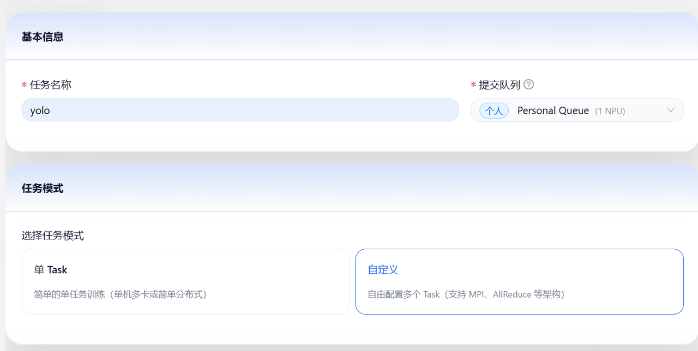

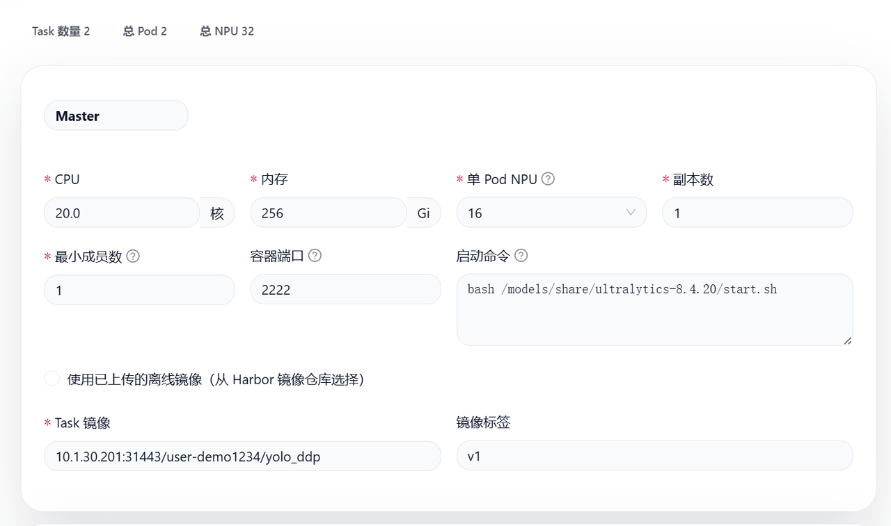

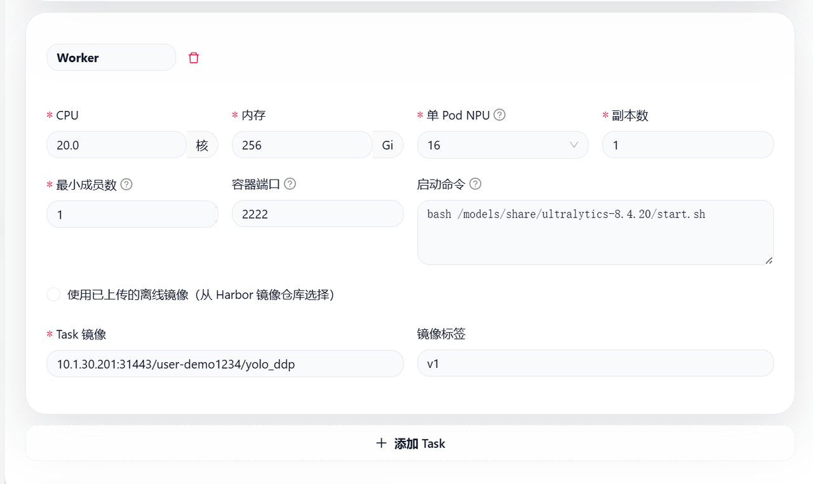

```Plain
bash /models/share/ultralytics-8.4.20/start.sh  #启动命令
10.1.30.201:31443/user-demo1234/yolo_ddp:v1     #镜像路径
```

# 基于mindspeedLLM启动Qwen-2.5-7b分布式训练实例

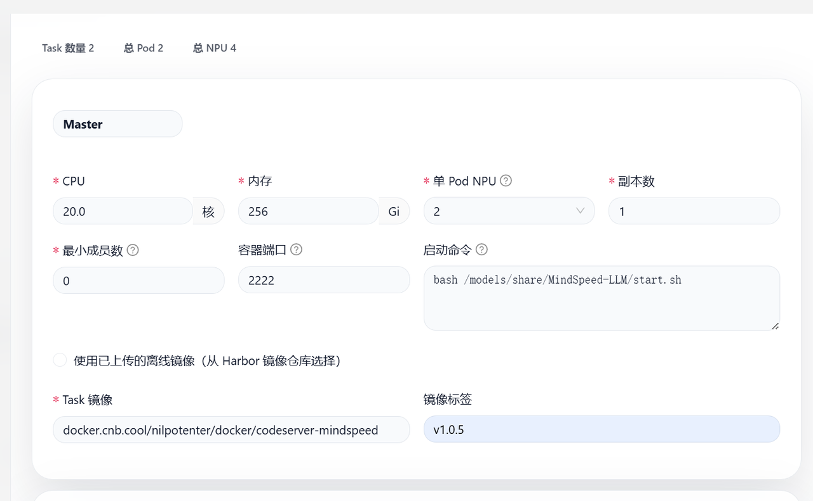

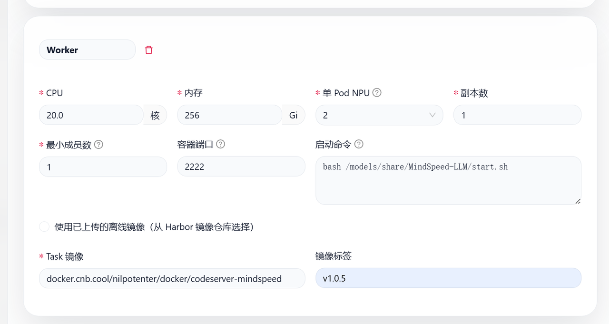

```Plain
bash /models/share/MindSpeed-LLM/start.sh						#启动命令
docker.cnb.cool/nilpotenter/docker/codeserver-mindspeed:v1.0.5	#镜像路径
```
