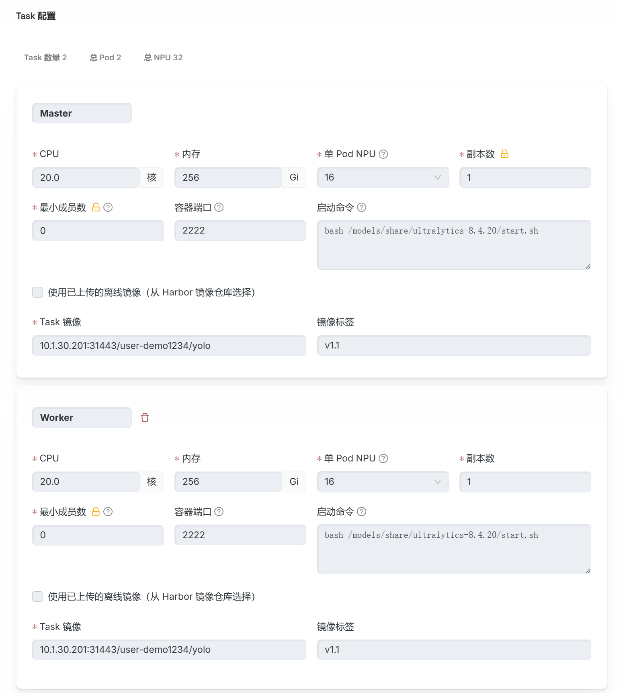
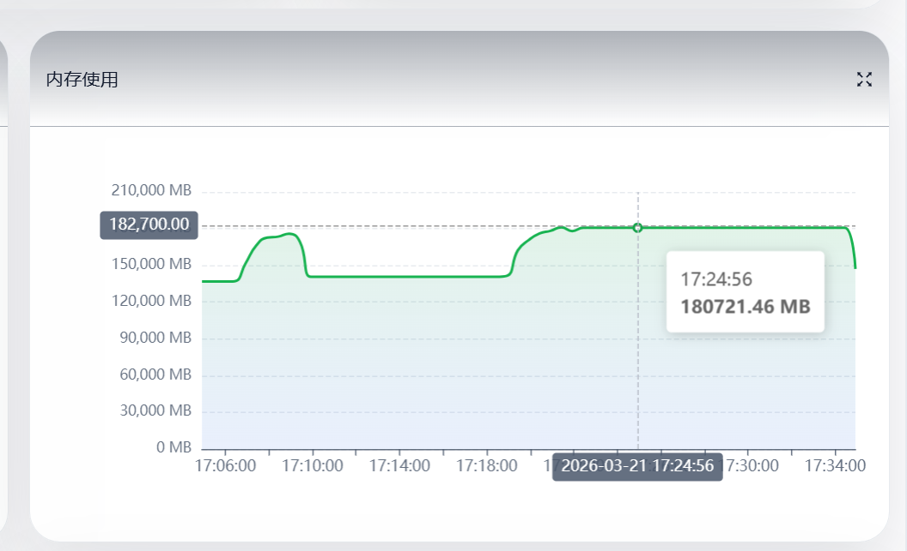
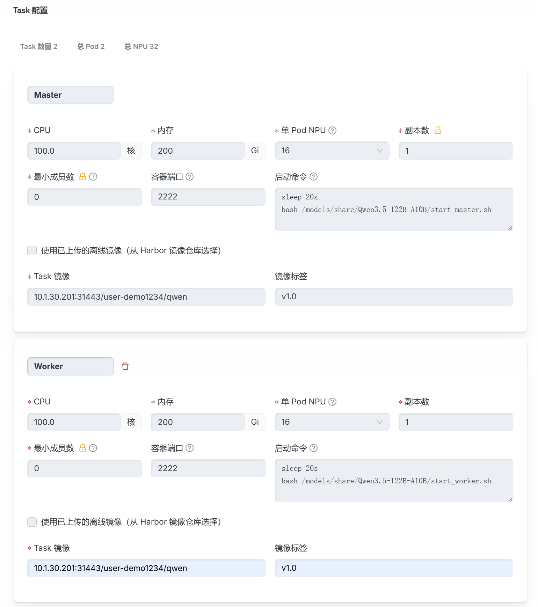

# 快速开始

本手册用于指导用户在调度平台上进行 ****Ascend（昇腾）环境下的多节点分布式训练与推理任务****，涵盖：

- 基础环境配置

- 基于torchrun启动yolo分布式训练实例

- 基于mindspeedLLM启动Qwen-2.5-7b分布式训练实例

- 基于VLLM-Ascned启动Qwen-3.5-1222B-A10B分布式推理实例

- 常见问题排查

# 基础环境配置

对于环境配置部分，建议使用Ascend官方或者社区提供的镜像，会在启动当中自动完成大部分环境配置。

首先使用`npu-smi info`命令确认所有显卡状态是否正常连接，如果没有正常显示使用以下命令尝试修复

```Bash
source /usr/local/Ascend/ascend-toolkit/set_env.sh#如果遇到报错提示没有source命令，使用下面命令进行环境变量设置
export    LD_LIBRARY_PATH=/usr/local/Ascend/driver/lib64:/usr/local/Ascend/driver/lib64/common:/usr/local/Ascend/driver/lib64/driver:$LD_LIBRARY_PATH
export ASCEND_TOOLKIT_HOME=/usr/local/Ascend/ascend-toolkit/latest
export LD_LIBRARY_PATH=${ASCEND_TOOLKIT_HOME}/lib64:${ASCEND_TOOLKIT_HOME}/lib64/plugin/opskernel:${ASCEND_TOOLKIT_HOME}/lib64/plugin/nnengine:${ASCEND_TOOLKIT_HOME}/opp/built-in/op_impl/ai_core/tbe/op_tiling/lib/linux/$(arch):$LD_LIBRARY_PATH
export LD_LIBRARY_PATH=${ASCEND_TOOLKIT_HOME}/tools/aml/lib64:${ASCEND_TOOLKIT_HOME}/tools/aml/lib64/plugin:$LD_LIBRARY_PATH
export PYTHONPATH=${ASCEND_TOOLKIT_HOME}/python/site-packages:${ASCEND_TOOLKIT_HOME}/opp/built-in/op_impl/ai_core/tbe:$PYTHONPATH
export PATH=${ASCEND_TOOLKIT_HOME}/bin:${ASCEND_TOOLKIT_HOME}/compiler/ccec_compiler/bin:${ASCEND_TOOLKIT_HOME}/tools/ccec_compiler/bin:$PATH
export ASCEND_AICPU_PATH=${ASCEND_TOOLKIT_HOME}
export ASCEND_OPP_PATH=${ASCEND_TOOLKIT_HOME}/opp
export TOOLCHAIN_HOME=${ASCEND_TOOLKIT_HOME}/toolkit
export ASCEND_HOME_PATH=${ASCEND_TOOLKIT_HOME}
```

对于分布式训练和推理，在ascend平台会使用华为官方的hccl（集合通信库），hccl会根据环境变量自动进行通信域的搭建，我们主要使用的是基于root节点信息创建通信域，使用以下代码进行环境的自动初始化，可以加在自己的启动命令前面，****对于单节点多卡训练的话，不要使用这个命令进行环境变量的初始化****。

```Bash
source /models/share/init_env.sh
```

上述命令会完成以下几个环境变量的设置

> ========================================

> Correct Simplified Distributed Environment Variables

> ========================================

> MASTER_IP=10.250.128.250

> MASTER_PORT=2222

> TOTAL_NODES=2

> CURRENT_NODE_RANK=0

> NPUS_PER_NODE=16

> TOTAL_NPUS=32

> ========================================

> Current Node Information:

> - Hostname: training-job-1773826727-3a2de9-master-0

> - Node IP: 10.250.128.250

> - Role: master

> ========================================

具体的使用会在后续的实例中演示。

# 基于torchrun启动yolo分布式训练实例

目前需要的权重和启动代码都已经放到/models/share共享目录当中了，直接在前端训练任务中启动即可




```Bash
bash /models/share/ultralytics-8.4.20/start.sh  #启动命令
10.1.30.201:31443/user-demo1234/yolo:v1.1       #镜像路径
```

# 基于mindspeedLLM启动Qwen-2.5-7b分布式训练实例


```Bash
bash /models/share/MindSpeed-LLM/start.sh                         #启动命令
docker.cnb.cool/nilpotenter/docker/codeserver-mindspeed:v1.0.5    #镜像路径
```

# 基于VLLM-Ascned启动Qwen-3.5-122B-A10B分布式推理实例





```Bash
bash /models/share/Qwen3.5-122B-A10B/start_master.sh   #master任务启动命令
bash /models/share/Qwen3.5-122B-A10B/start_worker.sh   #worker任务启动命令
10.1.30.201:31443/user-demo1234/qwen:v1.0              #镜像路径
```

当前启动这个推理任务采用的是DP=2，TP=8，PP=1的设置，可以按照需要进行更改，在开发环境中使用命令`vi /models/share/Qwen3.5-122B-A10B/start_master.sh`即可编辑里面的内容

```Bash
curl http://localhost:8010/v1/completions \  
-H "Content-Type: application/json" \  
-d '{    "prompt": "你是什么模型，你的参数量大小是多少，介绍一下你的功能",        
        "path": "/path/to/model/Qwen3.5-35B-A3B/",        
        "max_tokens": 100,        
        "temperature": 0        }'    
```

上面这个代码用于发送请求进行测试，当前需要进入master节点的终端运行

```Bash
vllm bench serve \    
--backend vllm \    
--base-url http://localhost:8010 \    
--model qwen3.5 \    
--tokenizer /mnt/model/corlorlight_models/Qwen3.5-122B-A10B \    
--dataset-name random \    
--num-prompts 10 \    
--request-rate inf \    
--input-len 128 \    
--output-len 256
```

上面这个是吞吐测试的代码，也需要进入master节点终端运行，如果是模型第一次推理会很慢，因为需要激活参数，所以测试的时候第一次的结果仅作为参考，后续进行的测试会是正常的性能情况
